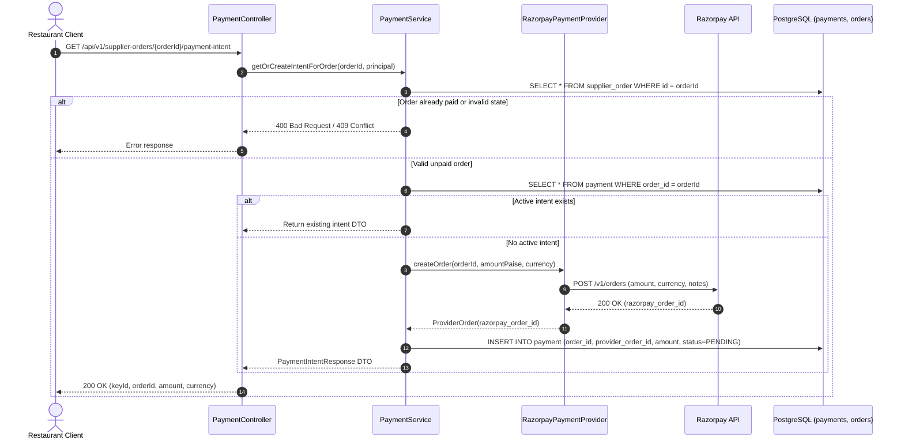
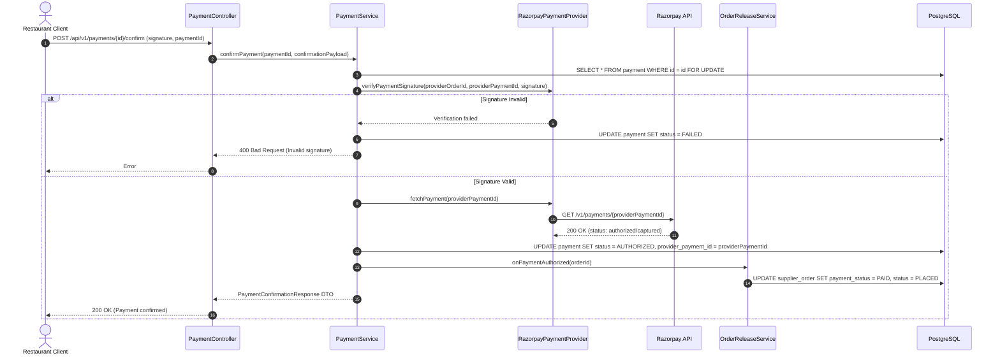
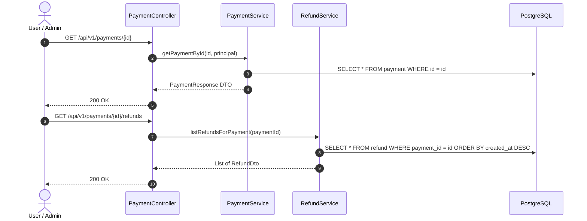
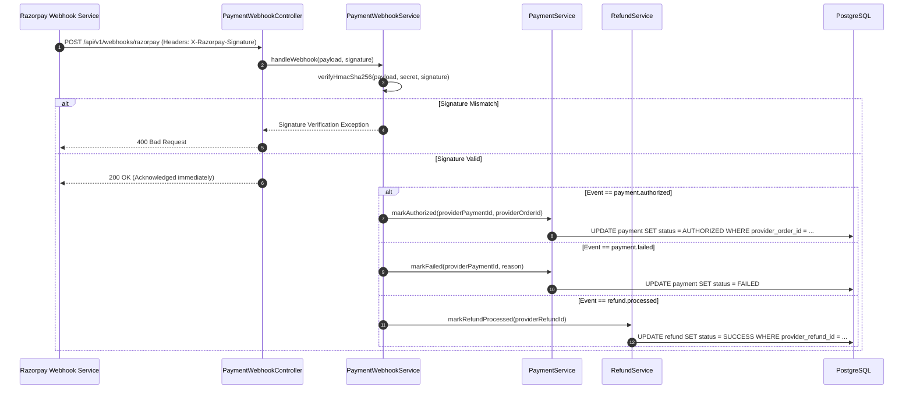
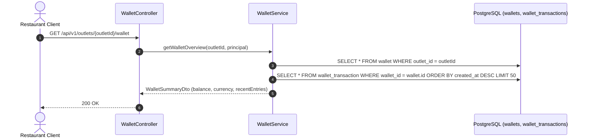
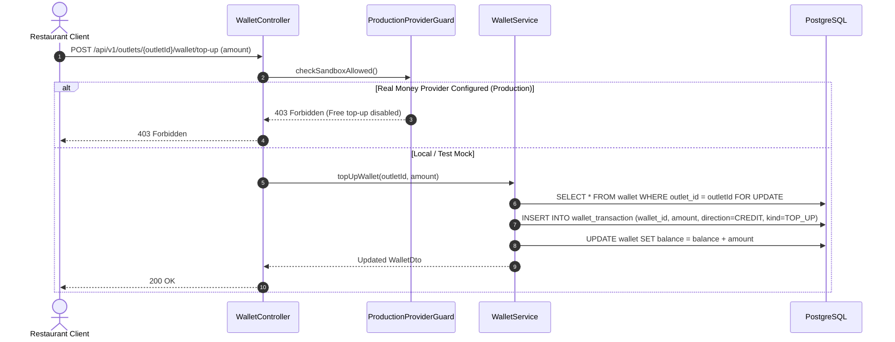
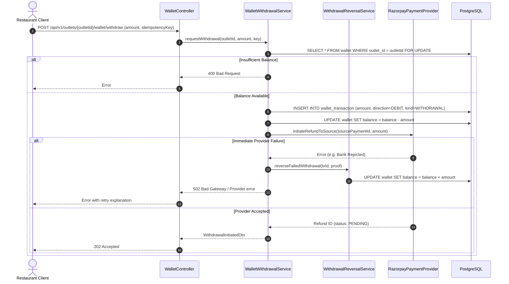
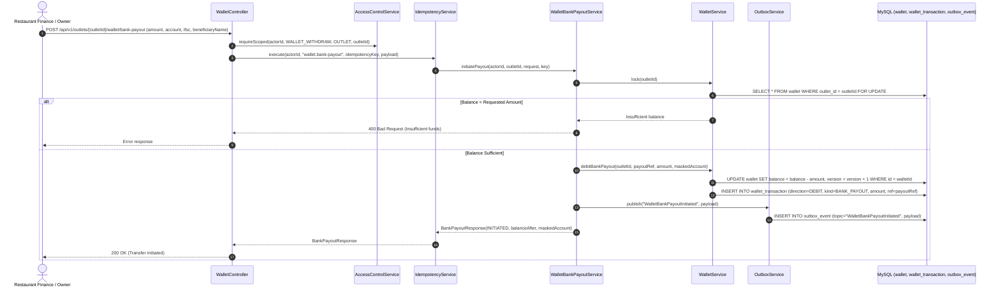

# Architecture Sequence Diagrams: Payments & Wallet Module

This document details the exact runtime request/response sequence diagrams for all endpoints in the **Payment** and **Wallet** modules.

---

## 1. `GET /api/v1/supplier-orders/{orderId}/payment-intent`
**Description**: Fetches or initializes payment intent details (Razorpay Order ID, amount in paise, currency, key) for a given supplier order so the client can trigger checkout.

---

## 2. `POST /api/v1/payments/{id}/confirm`
**Description**: Confirms payment completion after client checkout, verifying HMAC signature or provider authorization.

---

## 3. `GET /api/v1/payments/{id}` & `GET /api/v1/payments/{id}/refunds`
**Description**: Queries the live payment details or refund history associated with a payment record.

---

## 4. `POST /api/v1/webhooks/razorpay`
**Description**: Ingests asynchronous webhook events from Razorpay (payment authorized, captured, failed, refund processed).

---

## 5. `GET /api/v1/outlets/{outletId}/wallet`
**Description**: Retrieves wallet ledger balance, pending withdrawals, and statement entries.

---

## 6. `POST /api/v1/outlets/{outletId}/wallet/top-up`
**Description**: Top-up wallet funds (available in mock/sandbox; restricted in production environments with real payment gateways).

---

## 7. `POST /api/v1/outlets/{outletId}/wallet/withdraw`
**Description**: Requests a wallet withdrawal reversal back to the source bank account/card.

---

## 8. `POST /api/v1/outlets/{outletId}/wallet/bank-payout`
**Description**: Initiates payout from general wallet balance (including catch-weight refunds, doorstep rejections, and direct top-ups) directly to the restaurant's verified bank account via IMPS/NEFT.

