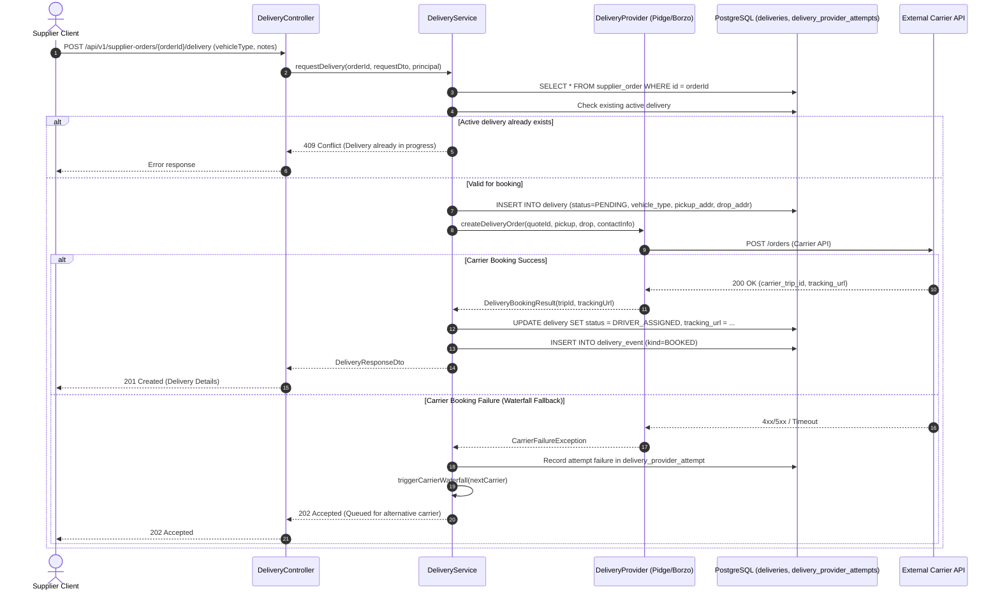
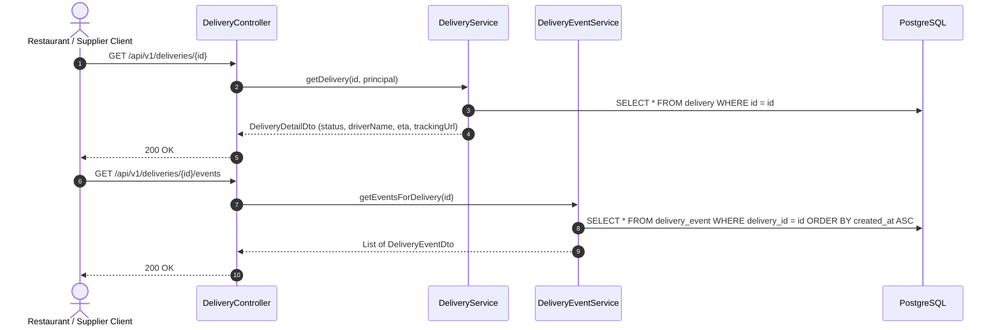
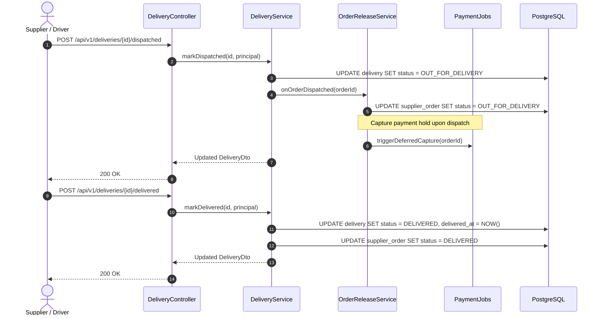
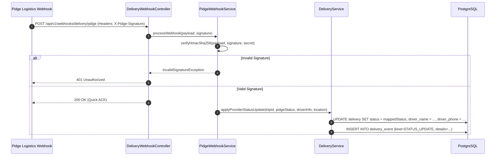
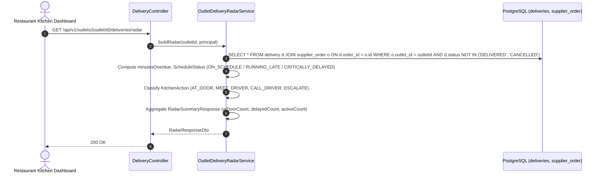
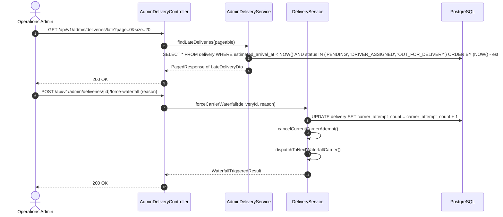

# Architecture Sequence Diagrams: Delivery & Logistics Module

This document details the exact runtime request/response sequence diagrams for all endpoints in the **Delivery & Logistics** module.

---

## 1. `POST /api/v1/supplier-orders/{orderId}/delivery`
**Description**: Initiates a 3PL delivery dispatch request (e.g., Pidge, Borzo) or self-delivery booking for a supplier order.

---

## 2. `GET /api/v1/deliveries/{id}` & `GET /api/v1/deliveries/{id}/events`
**Description**: Fetches live tracking status, driver location, and audit timeline for a delivery.

---

## 3. `POST /api/v1/deliveries/{id}/dispatched` & `POST /api/v1/deliveries/{id}/delivered`
**Description**: Lifecycle status transitions triggered by driver or supplier when goods leave the dock or are delivered.

---

## 4. `POST /api/v1/webhooks/delivery/pidge`
**Description**: Ingests live tracking updates and status webhooks from Pidge carrier with HMAC signature verification.

---

## 5. `GET /api/v1/outlets/{outletId}/deliveries/radar`
**Description**: Real-time kitchen radar endpoint ranking incoming deliveries by arrival urgency and identifying late deliveries.

---

## 6. `GET /api/v1/admin/deliveries/late` & `POST /api/v1/admin/deliveries/{id}/force-waterfall`
**Description**: Operations console monitoring for late deliveries and manual carrier escalation trigger.

