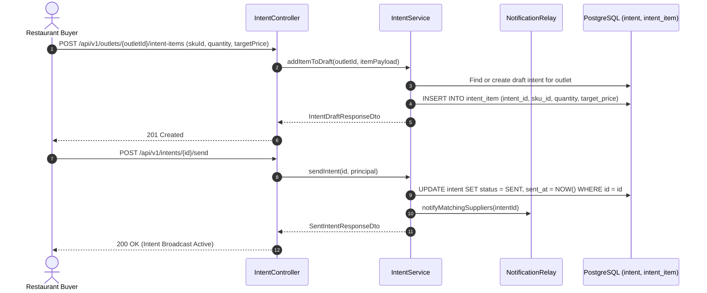
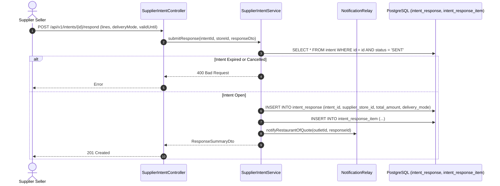
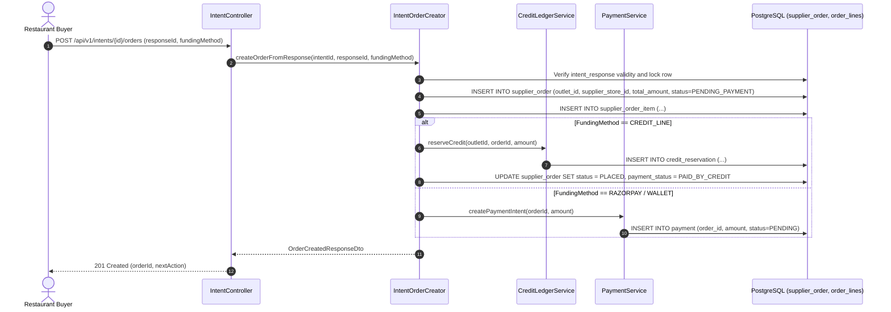
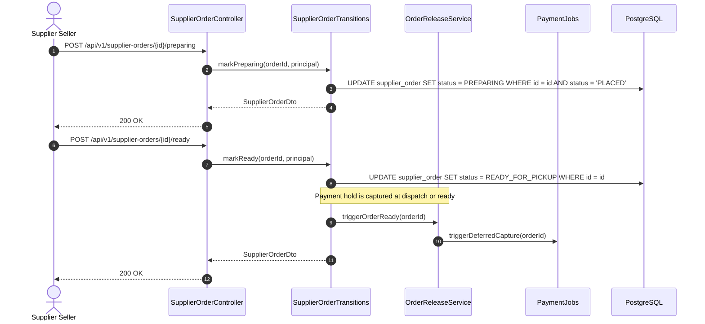
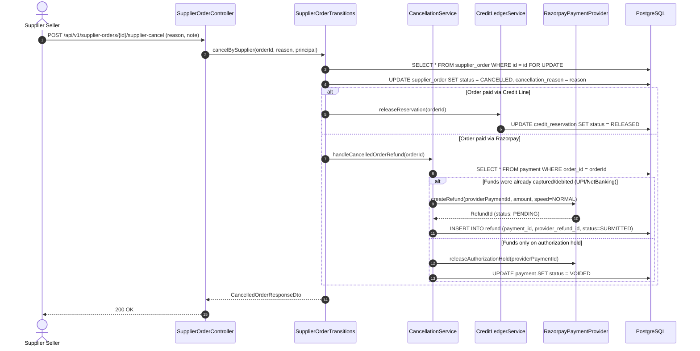

# Architecture Sequence Diagrams: Intent & Procurement Module

This document details the exact runtime request/response sequence diagrams for all endpoints in the **Intent** and **Procurement** modules.

---

## 1. `POST /api/v1/outlets/{outletId}/intent-items` & `POST /api/v1/intents/{id}/send`
**Description**: Restaurant builds an intent basket and broadcasts a request for quote (RFQ) to local suppliers.

---

## 2. `POST /api/v1/intents/{id}/respond` (Supplier Quotation)
**Description**: Supplier views open requests and submits pricing, available stock, and delivery mode.

---

## 3. `POST /api/v1/intents/{id}/orders` (Order Creation & Funding)
**Description**: Restaurant accepts a supplier's quote, locks basket pricing, and creates the definitive `supplier_order`.

---

## 4. `POST /api/v1/supplier-orders/{id}/preparing` & `POST /api/v1/supplier-orders/{id}/ready`
**Description**: Supplier order fulfillment lifecycle transitions.

---

## 5. `POST /api/v1/supplier-orders/{id}/supplier-cancel` (Cancellation & Refund)
**Description**: Supplier backs out of an order; automatically triggers debited UPI/card refunds and restores credit reservations.

