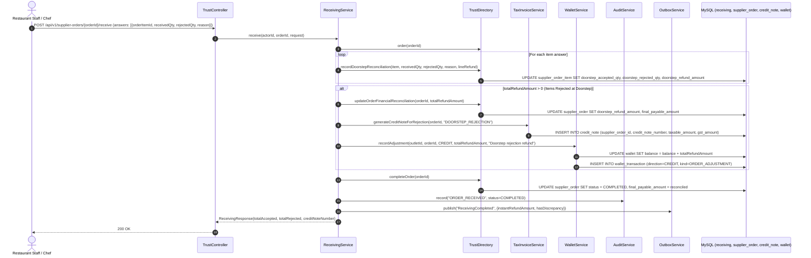
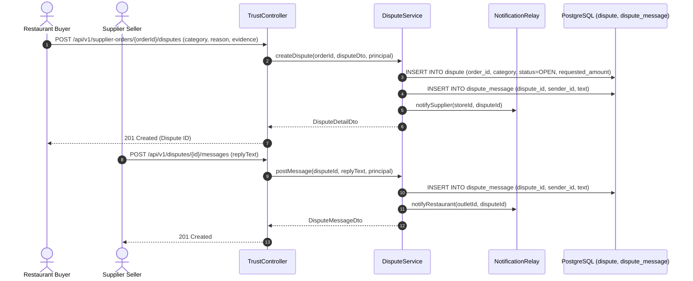
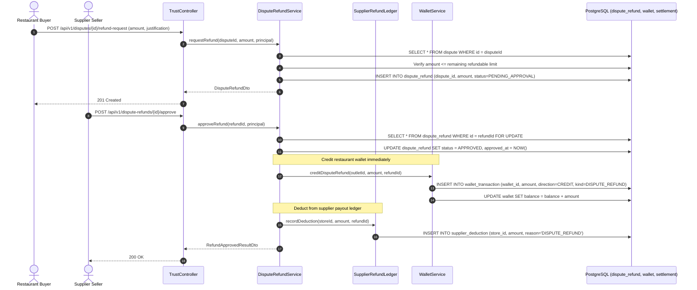
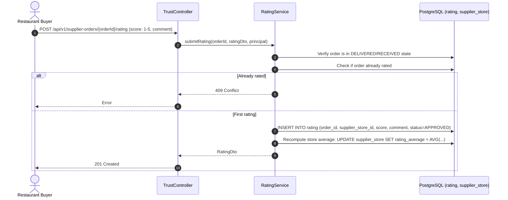

# Architecture Sequence Diagrams: Trust, Receiving & Disputes Module

This document details the exact runtime request/response sequence diagrams for all endpoints in the **Trust, Disputes, and Receiving** module.

---

## 1. `POST /api/v1/supplier-orders/{orderId}/receive` (Receiving Check-In & Doorstep Escrow)
**Description**: Restaurant kitchen receives order goods at the door, records accepted vs rejected quantities per line item with rejection reasons, generates instant wallet refunds for rejected goods, issues statutory GST Credit Notes (Section 34 CGST Act), and reconciles final payable amounts.

---

## 2. `POST /api/v1/supplier-orders/{orderId}/disputes` & `POST /api/v1/disputes/{id}/messages`
**Description**: Restaurant opens a formal dispute for bad quality, missing goods, or delivery issues, and engages in communication.

---

## 3. `POST /api/v1/disputes/{id}/refund-request` & `POST /api/v1/dispute-refunds/{id}/approve`
**Description**: Restaurant requests monetary compensation on a dispute; approval triggers wallet credits and supplier payout deductions.

---

## 4. `POST /api/v1/supplier-orders/{orderId}/rating`
**Description**: Restaurant submits quality, fulfillment speed, and service rating for the supplier store.

