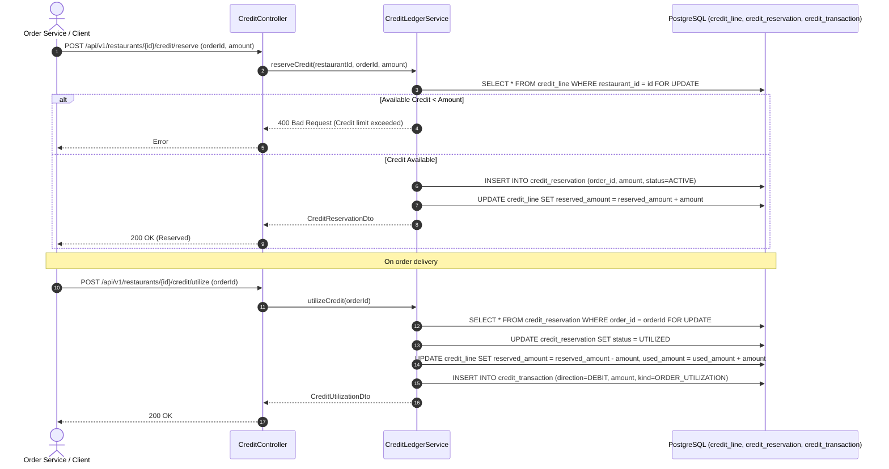
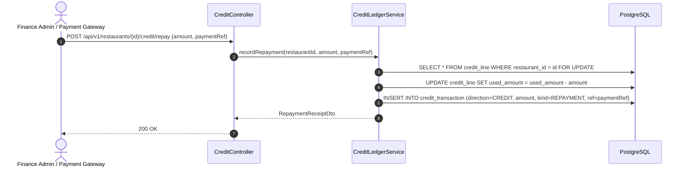
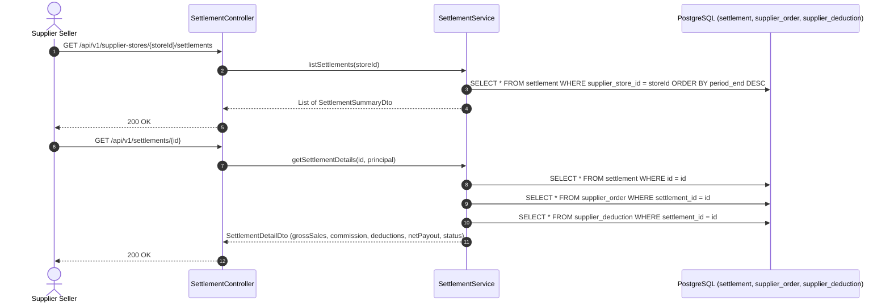
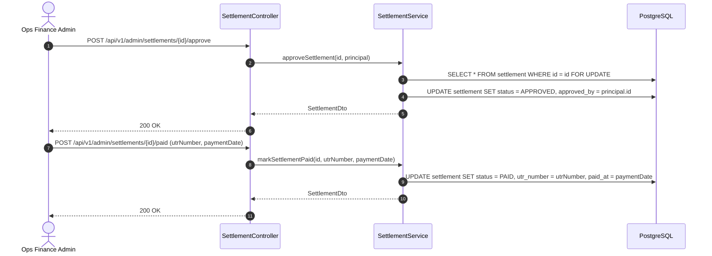
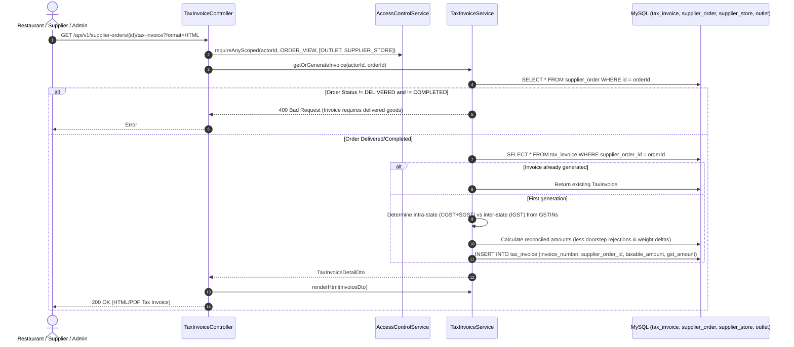

# Architecture Sequence Diagrams: Credit & Settlement Module

This document details the exact runtime request/response sequence diagrams for all endpoints in the **Credit Ledger** and **Supplier Settlement** modules.

---

## 1. `POST /api/v1/restaurants/{id}/credit/reserve` & `utilize`
**Description**: Two-phase credit ledger lifecycle: reservation during order placement, followed by utilization upon delivery or release upon cancellation.

---

## 2. `POST /api/v1/restaurants/{id}/credit/repay`
**Description**: Restaurant repays outstanding credit balance via bank transfer or gateway.

---

## 3. `GET /api/v1/supplier-stores/{storeId}/settlements` & Breakdown
**Description**: Supplier views settlement periods, gross sales, commission deductions, dispute withholdings, and net payout.

---

## 4. `POST /api/v1/admin/settlements/{id}/approve` & `/paid`
**Description**: Operations finance team approves verified payout calculations and tracks bank release.

---

## 5. `GET /api/v1/supplier-orders/{id}/tax-invoice` (Statutory GST Billing)
**Description**: Generates statutory GST B2B tax invoice (Section 31 CGST Act) on delivered/completed orders, verifying scoped access control, calculating CGST/SGST/IGST breakdown, and rendering printable HTML/PDF.

