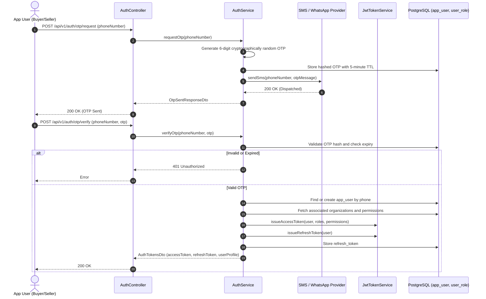
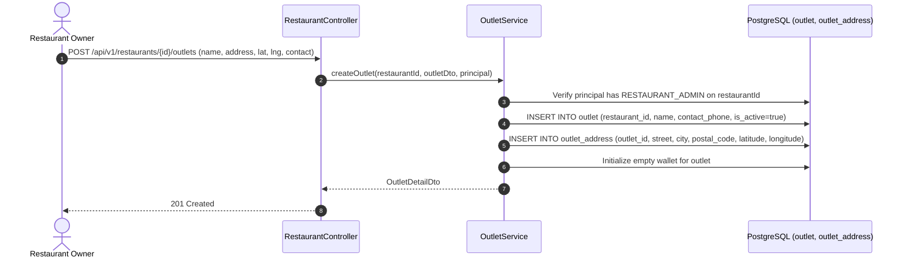
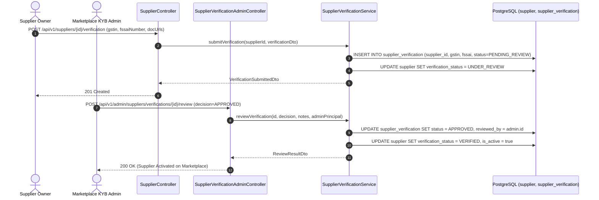

# Architecture Sequence Diagrams: Identity, Restaurants & Suppliers Module

This document details the exact runtime request/response sequence diagrams for all endpoints in **Identity/Auth**, **Restaurant Management**, and **Supplier Onboarding/Verification**.

---

## 1. `POST /api/v1/auth/otp/request` & `POST /api/v1/auth/otp/verify`
**Description**: Passwordless mobile OTP authentication, JWT access/refresh token generation, and user role claims.

---

## 2. `POST /api/v1/restaurants/{id}/outlets` (Outlet Provisioning)
**Description**: Restaurant organization adds a new physical outlet / delivery dock with geocoordinates and operating hours.

---

## 3. `POST /api/v1/suppliers/{id}/verification` & Admin Approval
**Description**: Supplier business verification workflow (FSSAI license, GSTIN, bank documents) and Admin KYB activation.

