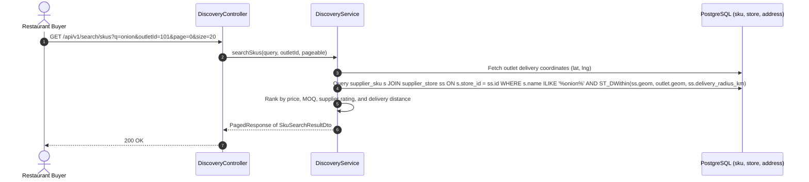
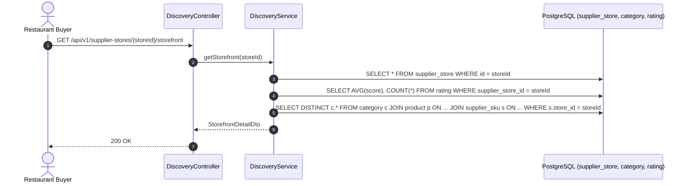
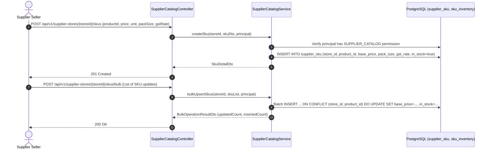

# Architecture Sequence Diagrams: Discovery & Catalog Module

This document details the exact runtime request/response sequence diagrams for all endpoints in the **Discovery, Search, and Catalog Management** modules.

---

## 1. `GET /api/v1/search/skus` & `GET /api/v1/search/suppliers`
**Description**: Geospatial and relevance search for wholesale SKUs and suppliers within the restaurant outlet's delivery radius.

---

## 2. `GET /api/v1/supplier-stores/{storeId}/storefront`
**Description**: Fetches supplier digital storefront banner, minimum order quantity (MOQ), operating schedules, and product catalog categories.

---

## 3. `POST /api/v1/supplier-stores/{storeId}/skus` & `/bulk`
**Description**: Supplier publishes or bulk updates inventory SKUs, base unit prices, GST rates, pack sizing, and availability.

