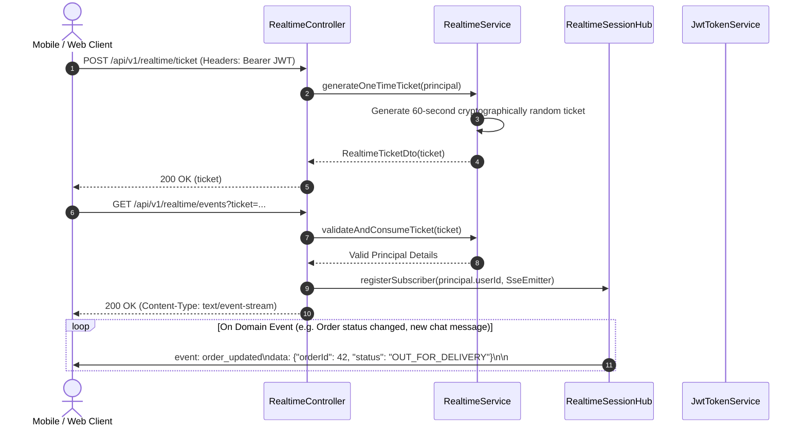
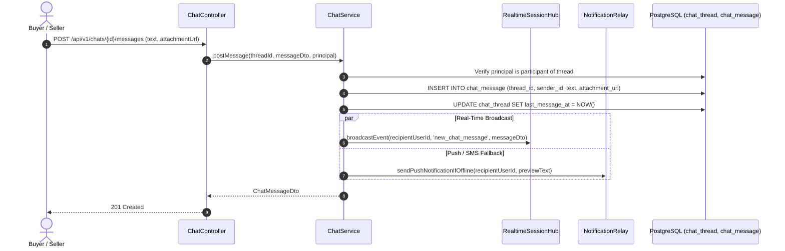
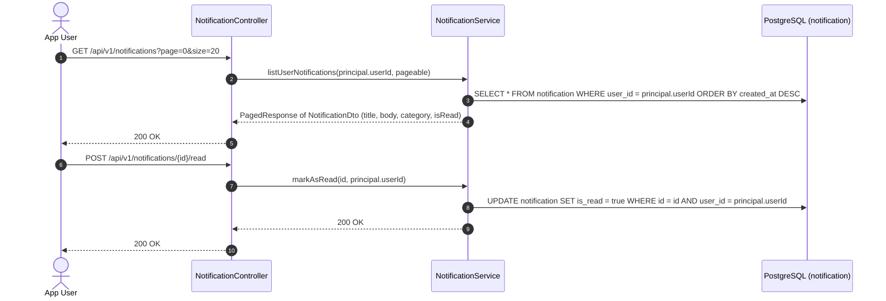
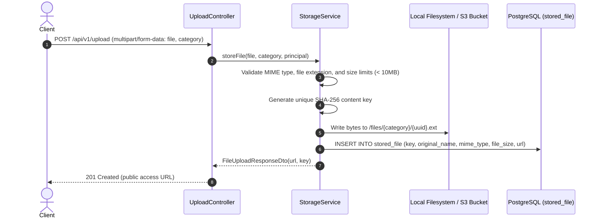
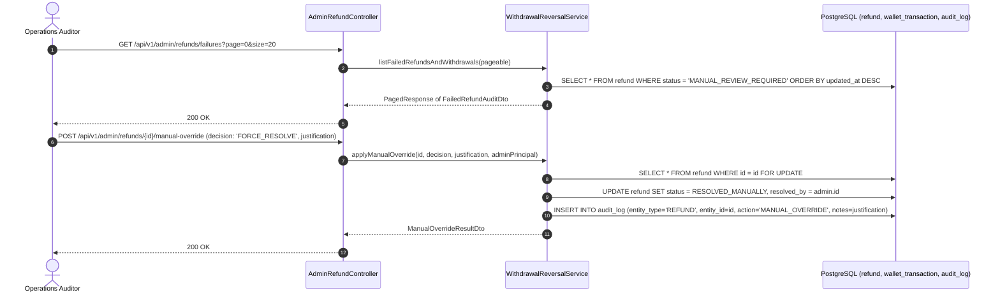

# Architecture Sequence Diagrams: Realtime, Chat, Notifications & Administration Module

This document details the exact runtime request/response sequence diagrams for all endpoints in **Realtime Streams (SSE)**, **In-App Chat**, **Notification Feeds**, **Media Storage**, and **Operations Admin**.

---

## 1. `POST /api/v1/realtime/ticket` & `GET /api/v1/realtime/events` (SSE Streaming)
**Description**: Authenticated ticket-based Server-Sent Events (SSE) subscription stream for live orders, chat messages, and driver locations.

---

## 2. `POST /api/v1/chats/{id}/messages` & Live Delivery
**Description**: Buyer-seller direct messaging regarding order specifications, delivery issues, or substitutes.

---

## 3. `GET /api/v1/notifications` & `POST /api/v1/notifications/{id}/read`
**Description**: Querying and acknowledging the user's persistent notification inbox feed.

---

## 4. `POST /api/v1/upload` (Document & Image Media Storage)
**Description**: Multi-part file upload for dispute evidence, product images, and supplier verification licenses.

---

## 5. `GET /api/v1/admin/refunds/failures` & `/manual-override`
**Description**: Operations console monitoring for failed automated refunds or withdrawals, with audited manual resolution actions.

